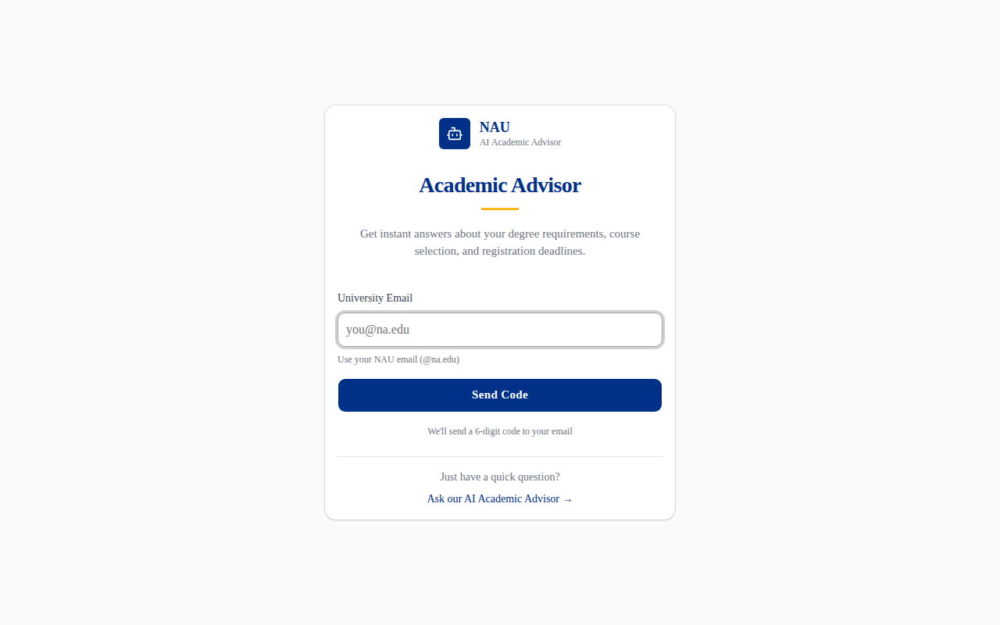
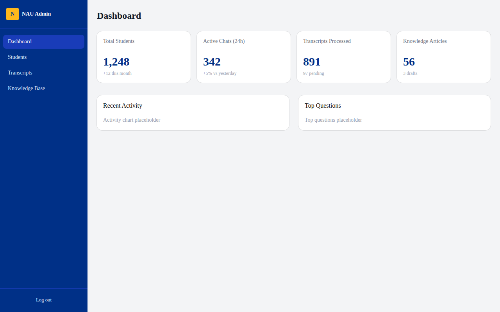
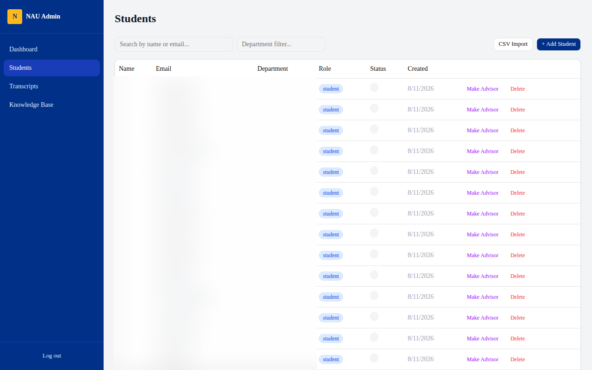
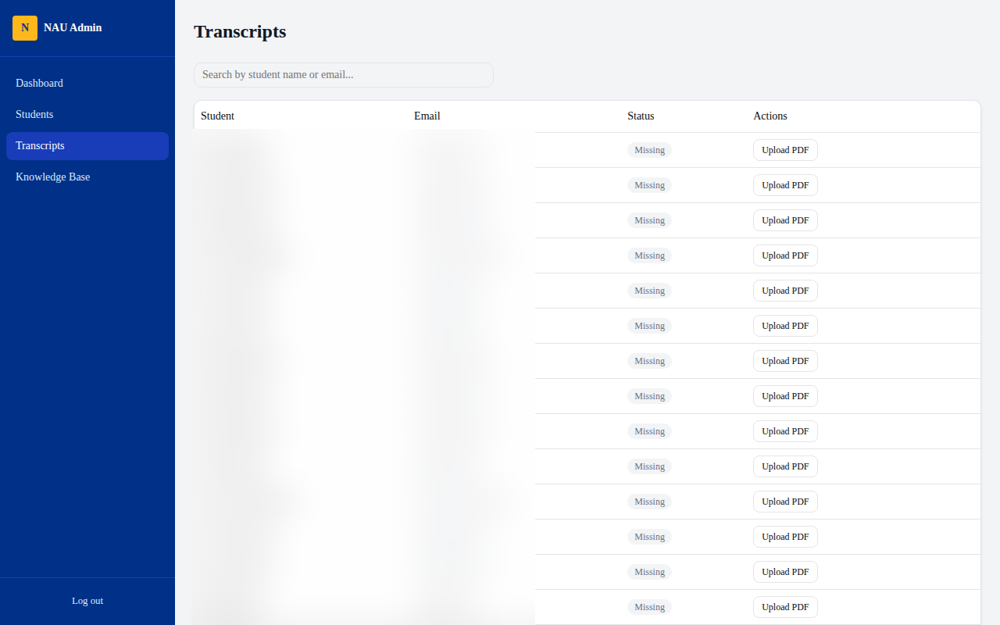
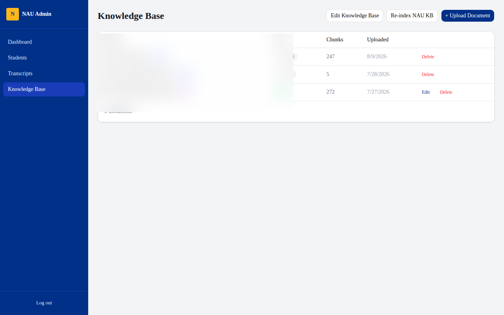
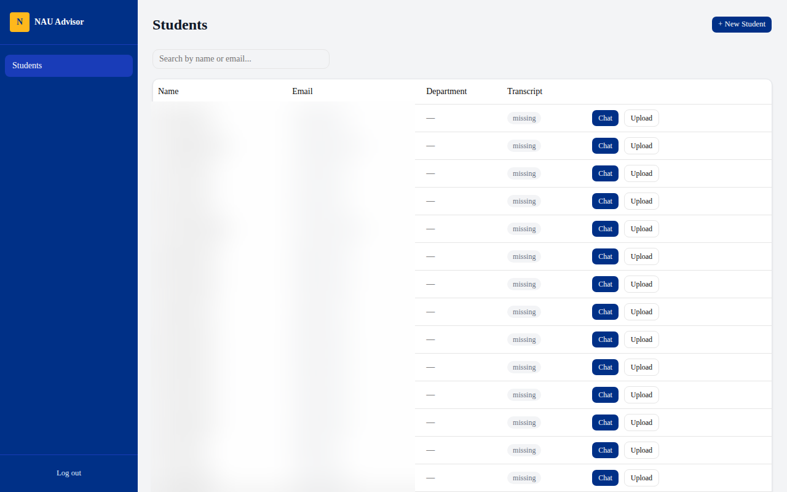

# NAU AI Academic Advisor

AI-powered academic advising system for National American University (NAU). Students get instant, personalized guidance on degree requirements, course selection, and registration — powered by Claude and a RAG knowledge base.

## Demo

https://github.com/user-attachments/assets/NAU_AI_Advisor_Demo.mp4

[▶ Watch Demo Video](docs/NAU_AI_Advisor_Demo.mp4)

## Screenshots

### Login (OTP Authentication)


### Admin Dashboard


### Student Management


### Transcript Processing (FERPA-compliant)


### Knowledge Base


### Advisor Panel


## Features

- **OTP Authentication** — Passwordless login via university email
- **Three Roles** — Student, Advisor, Administrator
- **AI Chat** — Claude-powered academic advising with RAG context
- **Transcript Analysis** — Upload and analyze academic transcripts with FERPA-compliant anonymization (Presidio NER + AES-256 encryption)
- **Knowledge Base** — Indexed university catalog, courses, requirements, and FAQ
- **Advisor Portal** — Advisors manage students, upload transcripts, and chat in student context
- **Admin Panel** — Dashboard, student management, CSV import, knowledge base management

## Tech Stack

- **Frontend**: Next.js 16 (App Router)
- **Backend**: NestJS
- **Database**: PostgreSQL (TypeORM)
- **AI**: Claude (Anthropic) + RAG with embeddings
- **Anonymization**: Presidio (ML NER) + regex fallback + AES-256 encryption
- **Auth**: OTP-based (no passwords)

## Architecture

```
┌─────────────┐     ┌─────────────┐     ┌──────────────┐
│   Next.js   │────▶│   NestJS    │────▶│  PostgreSQL   │
│  Frontend   │     │   Backend   │     │   Database    │
│  :4001      │     │   :4000     │     │   :5433       │
└─────────────┘     └──────┬──────┘     └──────────────┘
                           │
                    ┌──────┴──────┐
                    │   Claude    │
                    │   (LLM)    │
                    └──────┬──────┘
                           │
                    ┌──────┴──────┐
                    │  Embedding  │
                    │  Server     │
                    │  :9430      │
                    └─────────────┘
```

## Privacy & Compliance

- **FERPA-compliant**: All student data is anonymized before storage and before sending to LLM
- **Pipeline**: PDF → PyMuPDF → Presidio NER (PERSON, SSN, EMAIL, PHONE) → regex fallback → AES-256 encrypt → store
- **No raw text stored**: Only encrypted, anonymized text is persisted
- **Advisor chat context**: Decrypted sanitized text sent to Claude, never raw transcripts

## Setup

```bash
# Backend
cd apps/api
cp .env.example .env  # Configure DB, SMTP, Anthropic API key
npm install
npm run build
npm start

# Frontend
cd apps/web
cp .env.local.example .env.local
npm install
npm run build
npm start
```

## License

Proprietary — National American University
